# I - Online-Retail-Project
Đây là một tập dữ liệu chứa tất cả các giao dịch diễn ra từ ngày 01/12/2010 đến ngày 09/12/2011 của một công ty bán lẻ trực tuyến không có cửa hàng tại UK. Công ty này chủ yếu bán các mặt hàng quà tặng độc đáo cho mọi dịp. Nhiều khách hàng của công ty là các nhà bán buôn

# II - Data Cleaning
- Check giá trị null => loại bỏ tất cả dòng chứa giá trị null
- Check datatype
- Một số dòng mang giá trị âm => điều chỉnh lại
- Thêm cột amount = quantity*unit_price
- Trích xuất thời gian từ cột invoice_date (hour, day, month, year_month, week_days)
- Xóa những dòng bị duplicate

# III - Exploratory Data Analysis (EDA) & Visualization

## 1. How many monthly active user (MAU) each month?

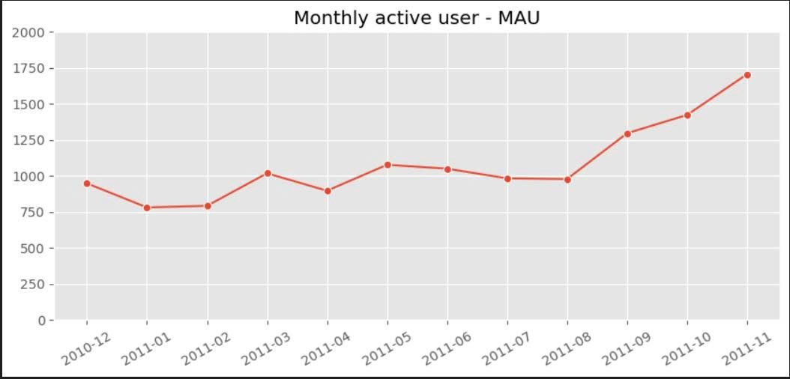

Số lượng khách hàng có xu hướng tăng theo hằng tháng,mặc dù đầu năm 2011 có chút giảm nhẹ. Khoảng thời gian tăng trưởng mạnh nhất từ tháng 8/2011 - 11/2011 (tăng từ 977 KH lên 1705 KH => tăng 74.5%) 
Sự tăng đột biết cuối năm có thể do yếu tố mùa vụ (seasonality) ảnh hưởng. Như các dịp lễ hay marketing cuối năm
=> Doanh nghiệp cần chuẩn bị nguồn hàng trước mua cao điểm cũng như có thể tăng chính sách marketing 
## 2. How are the number of orders and total order amount each month?

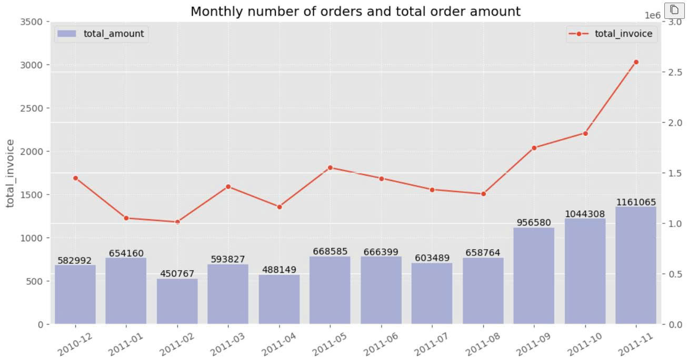

Kết quả cho thấy số lượng đơn hàng và doanh thu hằng tháng của công ty đều tăng lên, tỷ lệ thuận với số lượng KH hằng tháng phía trên.
Tăng mạnh nhất cùng gia đoạn 8/11- 11/11
=> Cho thấy doanh nghiệp đang thực hiện tốt chiến lược kinh doanh. 
Có thể đề xuất triển khai upsell/bundle

## 3. Analyze the number of customers by weekdays and by hour

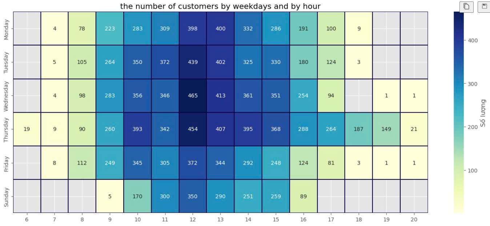

Công ty không có KH mua hàng vào thứ 7. Số lượng KH mua hàng nhiều rơi vào khung giờ từ 9h đến 15h (đặc biệt là khung giờ nghỉ trưa 12h) và tập trung chủ yếu vào các ngày giữa tuần từ thứ 3 đến thứ 5 thay vì cuối tuần. 
Điều này cho thấy khách hàng có xu hướng mua sắm trong giờ hành chính hoặc giờ nghỉ trưa, thay vì buổi tối hoặc cuối tuần.
=> Doanh nghiệp có thể thực hiện chạy marketing vào khung giờ 10h – 13h để tối ưu. 
Bổ sung thêm nhân lực hỗ trợ các ngày giữa tuần
Xem xét, phân tích thêm vì sao KH không mua hàng vào cuối tuần 

## 4. Top 10 Contries bring most sales for the company?

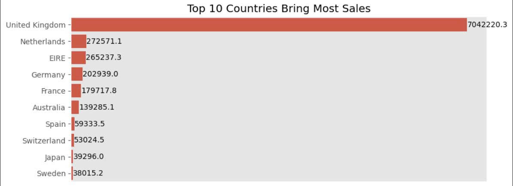

UK là quốc gia mang lại doanh thu cao nhất khoảng 7.042.220, cao gấp nhiều lần so với quốc gia đứng thứ hai.
=> đây là thị trường chủ lực có vai trò quan trọng 
Và lần lượt các quốc gia theo sau như Netherlands, EIRE, Germany.
=> Doanh nghiệp nên tập trung vào thị trường UK là chính và có thể đầu tư thêm ở các nước Netherlands, EIRE, Germany..Tuy nhiên nếu phụ thuộc quá nhiều vào 1 quốc gia đôi khi cũng sẽ có rủi ro tiềm ẩn như xảy ra tranh chấp, cấm vận...

## 5. Countries with most AOV - Average Order Value

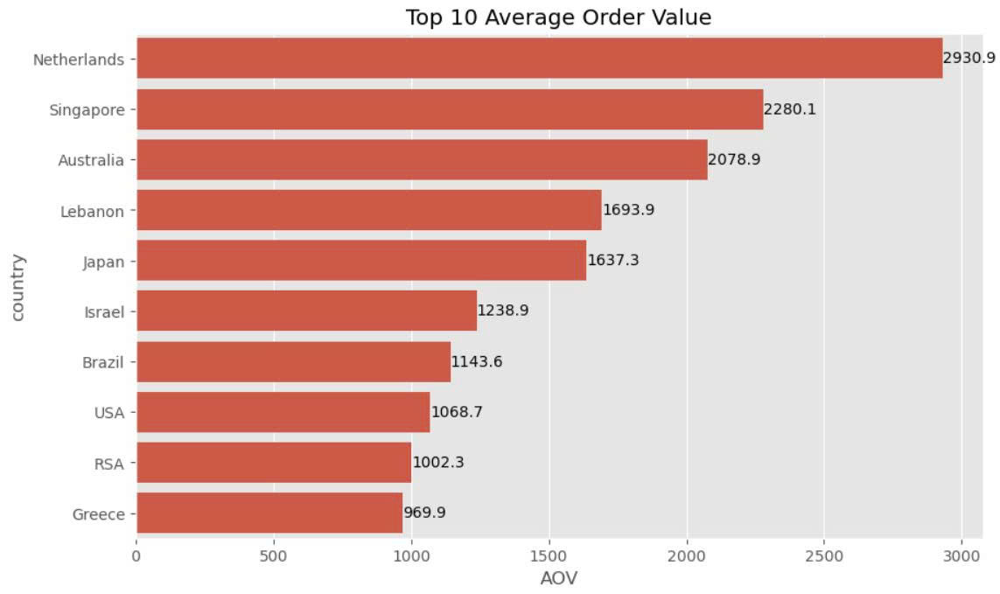

Xét về giá trị trung bình mỗi đơn hàng (AOV), Netherlands dẫn đầu với mức khoảng 2.930,9, cao hơn đáng kể so với các quốc gia khác.
Và lần lượt theo sau là Singapore, Singapore, Singapore,..
=> Điều này cho thấy một số thị trường tuy không có tổng doanh thu lớn nhưng lại có giá trị đơn hàng trung bình rất cao.
Các quốc gia có AOV cao là nhóm khách hàng có sức chi tiêu lớn
=> Tăng cường quảng bá các sản phẩm giá trị cao tại những thị trường này 

## 6. How many new and old customers do you have each month

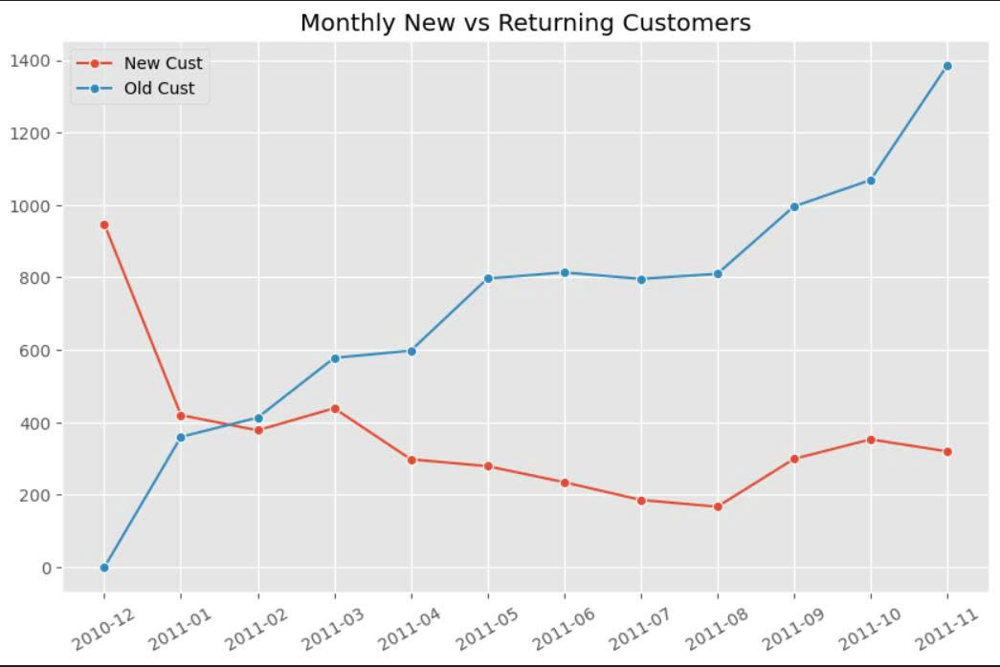

Số lượng KH cũ của công ty vấn quay lại mua tăng ngày càng nhiều so với lượng khách mới thì có chiều hướng giảm 
Điều này cho thấy doanh thu tăng trưởng phần lớn đến từ khách hàng trung thành quay lại mua hàng
=> cDoanh nghiệp tập trung vào giữ chân KH hàng tốt (có nhiều ưu đãi cho KH cũ) hoặc chất lượng sản phẩm và giá thành hợp lý nên KH quay lại.
Tuy nhiên cũng nên quan tâm đến chiến lược thu hút thêm nguồn KH mới 

## 7. Considering the new customers of December 2010, what is the average transaction value of these customers in each month when they return

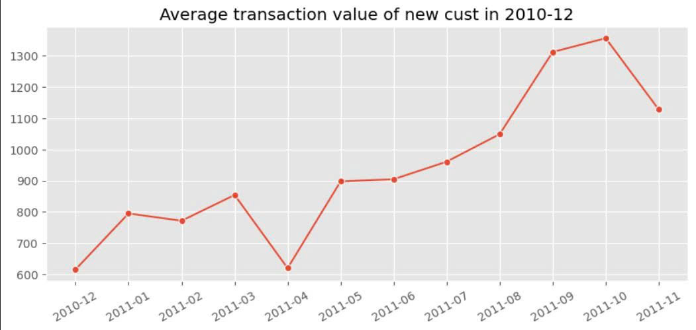

Khách hàng đã mua hàng vào 12/2010 quay lại mua hàng nhiều hơn có xu hướng tăng dần qua các tháng, tăng mạnh nhất vào khoảng 7/2011- 10/2011
Sau khi giảm nhẹ vào khoảng tháng 04/2011, chỉ số này phục hồi và tăng liên tục, đạt đỉnh vào khoảng tháng 09–10/2011.
=> KH có xu hướng quay lại mua hàng dịp cuối năm => Doanh nghiệp cần đẩy mạnh chương trình marketing hơn vào cuối năm cũng như đảm bảo chất lượng dịch vụ để KH hài lòng 

## 8.Customer Segmentation

Phân khúc Khác Hàng sẽ dựa vào 2 phân khúc:
- Recency - Gần nhất: Recency là chỉ số đo lường khoảng thời gian kể từ lần cuối cùng khách hàng tương tác với sản phẩm hoặc dịch vụ của bạn. Câu hỏi chúng ta cần đặt ra là: `"Lần cuối cùng khách hàng này mua hàng của chúng ta đến hiện tại là mấy ngày
      + Khách hàng mới mua gần đây: Đây là những người đã mua sản phẩm hoặc dịch vụ gần đây nhất. Họ có thể đang cảm thấy hài lòng hoặc có nhu cầu cao.
      + Khách hàng mua từ lâu: Họ đã không mua hàng trong một thời gian dài, có thể họ đã quên sản phẩm của chúng ta hoặc đã tìm thấy sự lựa chọn khác.
  
- Frequency - Tần suất: Frequency đo lường số lần khách hàng mua hàng trong một khoảng thời gian nhất định. Câu hỏi cần trả lời là: `"Khách hàng này đã mua hàng bao nhiêu lần
      + Khách hàng thường xuyên: Họ mua hàng nhiều lần, cho thấy họ trung thành và có thể là những người yêu thích sản phẩm.
      + Khách hàng ít mua: Họ ít mua hàng, có thể họ chỉ mua sản phẩm khi cần thiết hoặc có dịp đặc biệt.

  
  

 Map Khách Hàng vào các phân khúc sau: 

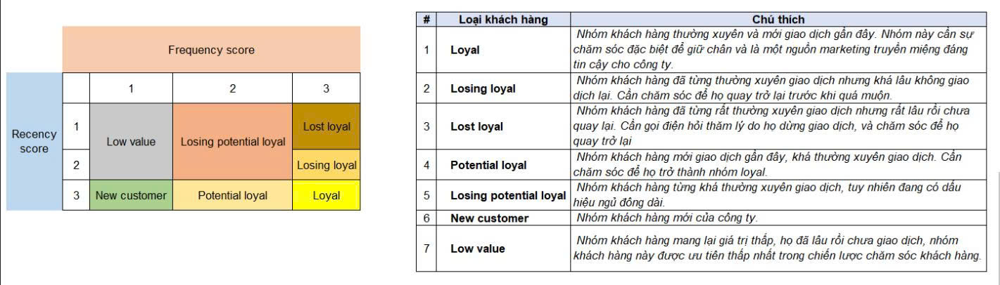

Visualization 

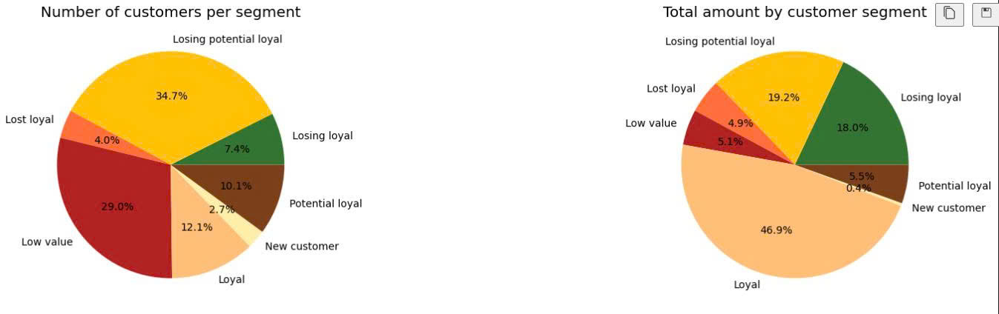 

tỷ lệ khách hàng và doanh thu theo từng phân khúc không tương đồng với nhau
Low value chiếm 29% lượng KH nhưng chỉ đem về doanh thu 5.1%
ngược lại Loyal chỉ chiếm 12.1% lượng KH nhưng đem lại doanh thu rất cao 46.9%
Losing potential loyal chiếm lượng KH lớn nhất 34.7%, doanh thu đem lại 19.2% cũng tương đối nhưng vẫn chưa hiệu quả 
=> Nhóm Loyal customers là nhóm khách hàng giá trị cao (VIP), cần ưu tiên chăm sóc và duy trì.
Nhóm Losing potential loyal là nhóm tiềm năng, nếu có chiến lược giữ chân phù hợp có thể chuyển đổi thành loyal customers.
Nhóm Low value nên được tối ưu chi phí marketing để tránh lãng phí nguồn lực.

## 9. Customer Behavior Analysis Using Cohort Analysis

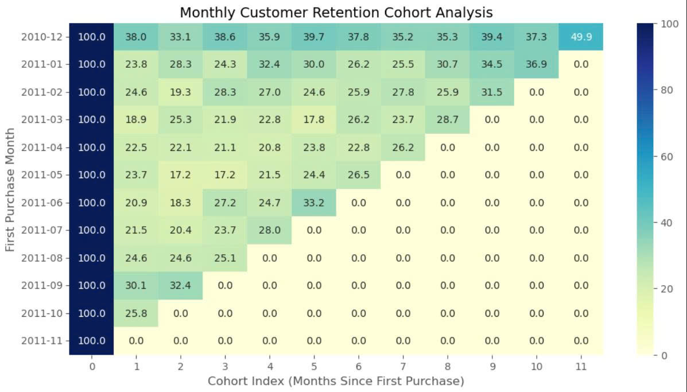 

- Retention giảm mạnh ngay sau tháng đầu tiên (chỉ còn khoảng 18%–30%), cho thấy tỷ lệ churn sau lần mua đầu rất cao (~70–80%). 
- Không quan sát thấy xu hướng cải thiện retention theo thời gian giữa các cohort, cho thấy chiến lược giữ chân khách hàng chưa có sự thay đổi rõ rệt
- Cohort cuối năm 2010 có tỷ lệ quay lại vượt trội so với các cohort khác, có thể liên quan đến yếu tố mùa vụ hoặc các chiến dịch marketing cuối năm

=> Doanh nghiệp nên tập trung vào chiến lược giữ chân sau lần mua đầu tiên (đẩy mạnh chăm sóc KH sau mua, có chương trình cho KH thành viên,...)

## 10. ABC Analysis

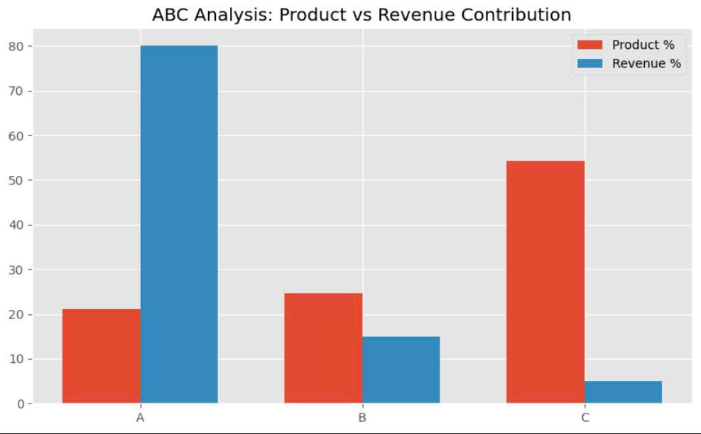

Nhóm A là nhóm sản phẩm chiến lược. Tuy chỉ chiếm 21% trên tổng số lượng sản phẩm nhưng đem lại doanh thu cao 80%.
=> Nên tập trung vào nhóm này. Kiểm tra kỹ tồn kho tránh out-of-stock vì nó sẽ ảnh hướng đến doanh thu của công ty.
Đồng thời đẩy mạnh marketing và các chương trình khuyến mãi cho nhóm này
Nhóm B chiếm 15% doanh thu - nhóm trung bình
=> Nếu có chiến lược marketing và chương trình giá tốt => có tiềm năng phát triển thành nhóm A trong tương lai
Nhóm C - nhóm chiếm số lượng nhiều nhất nhưng doanh thu chỉ 5%
=> Có thể giảm bớt số lượng tồn kho, thậm chí 1 số sản phẩm doanh thu quá thấp có thể loại bỏ bớt để tiết kiệm chi phí marketing, kho cũng như nhân lực

 

  

